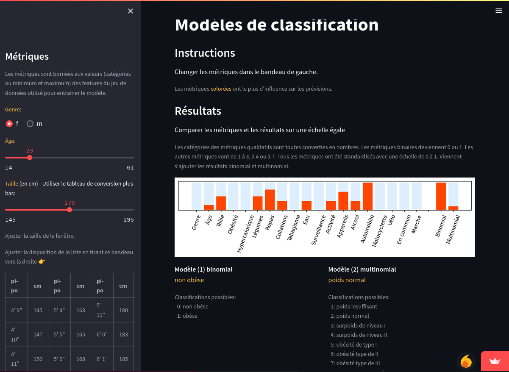

# Machine Learning avec Random Forests; Streamlit 

Le projet est l'étape finale (MLOps) : le déploiement d'un modèle de Machine Learning avec Python. Le modèle prédit la propension à l'obésité. 
Bouton droit vers : <a href="https://ugolabo-ml-random-forests-st-01-modele-widb6v.streamlit.app/" target="_blank">site</a>.

## Origine du projet

Consulter le dépôt les étapes précédant le déploiement : **ml_random_forests**.

## Mise en place et structure

Streamlit permet de construire des apps interactives avec un code source Python. Consulter le sous-répertoire du projet.

La structure du sous-répertoire du projet est la configuration requise par Streamlit Cloud pour construire l'interface graphique. L'app intègre deux morceaux importants : les versions 1 et 2 du modèle en format Pickle. Comme il s'agit d'un modèle de Random Forests, les scalers n'ont pas été retenus. Les Randoms Forests règlent beaucoup de problèmes dont les autres modèles de classification souffrent. Les Random Forests ne sont pas affectées par les disparités de variances entre features.

L'app obtenue est une interface graphique qui permet de modifier les facteurs de vie comme si on fournissait au modèle de nouvelles données. Chaque changement déclenche un calcul des prévisions (c'est l'interaction). Les données entrent dans le modèle et deux prévisions en ressortent : versions 1 et 2 du modèle. 

Bouton droit vers : <a href="https://ugolabo-ml-random-forests-st-01-modele-widb6v.streamlit.app/" target="_blank">site</a>.
